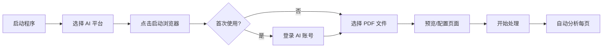

# PDF AI Analyzer

<p align="center">
  <strong>🤖 多平台 AI 图像分析自动化工具</strong>
</p>

<p align="center">
  <a href="./README_EN.md">English</a> | 简体中文
</p>

<p align="center">
  
  
  
  
  
</p>

---

## ✨ 功能特点

PDF AI Analyzer 是一款自动化工具，能够将 PDF 文件逐页转换为图片，并自动发送到多个主流 AI 平台进行分析和解释。

### 🎯 核心功能

| 功能 | 描述 |
|------|------|
| 📄 **PDF 转图片** | 使用 PyMuPDF 高质量转换 PDF 页面（无需 Poppler） |
| 🤖 **多平台支持** | 支持 ChatGPT、Claude、Google Gemini、DeepSeek |
| 🔄 **全自动处理** | 自动上传图片、发送提示词、等待回复、处理下一页 |
| 💾 **会话持久化** | 浏览器登录状态自动保存，无需重复登录 |
| 🎨 **精美界面** | Glassmorphism 深空玻璃拟态设计风格 |
| 🌐 **双语界面** | 支持中文/英文界面一键切换 |
| 📑 **页面分组** | 可自定义分组，将多页一次性发送给 AI 分析 |
| 🔢 **自定义顺序** | 支持自定义批次处理顺序 |
| 🔁 **智能重试** | 空白响应自动重试机制（可配置重试次数） |
| ⏸️ **暂停继续** | 支持暂停处理并从断点继续 |
| 💬 **自动新建聊天** | 每PDF/每N页自动创建新聊天窗口 |
| ↩️ **撤销操作** | Ctrl+Z 支持撤销页面勾选操作，批量操作一次性撤销 |
| ⏸️ **API限流自动暂停** | 检测到API限流时自动暂停，可配置自动恢复 |

### 🌐 支持的 AI 平台

| 平台 | 网址 | 状态 |
|------|------|------|
| ChatGPT | chatgpt.com | ✅ 完整支持 |
| Google Gemini | gemini.google.com | ✅ 完整支持 |
| DeepSeek | chat.deepseek.com | ✅ 完整支持 |
| Claude | claude.ai | ✅ 完整支持 |

---

## 📦 安装

### 系统要求

- **操作系统**: Windows 10/11、macOS、Linux
- **Python**: 3.11 或更高版本
- **浏览器**: Chrome 或 Edge（Playwright 自动管理）

### 方式一：使用预构建版本（推荐）

从 [Releases](https://github.com/NeoNumber01/PDF_AI_Analyzer/releases) 页面下载对应平台的压缩包：

- **Windows**: `PDF_AI_Analyzer-Windows.zip`
- **macOS**: `PDF_AI_Analyzer-macOS.zip`
- **Linux**: `PDF_AI_Analyzer-Linux.tar.gz`

解压后直接运行 `PDF_AI_Analyzer` 可执行文件即可。

### 方式二：从源码安装

```bash
# 1. 克隆仓库
git clone https://github.com/NeoNumber01/PDF_AI_Analyzer.git
cd PDF_AI_Analyzer

# 2. 创建虚拟环境
python -m venv venv

# 3. 激活虚拟环境
# Windows PowerShell:
.\venv\Scripts\Activate.ps1
# Windows CMD:
.\venv\Scripts\activate.bat
# macOS/Linux:
source venv/bin/activate

# 4. 安装依赖
pip install -r requirements.txt

# 5. 安装 Playwright 浏览器
playwright install chromium
```

> 💡 **提示**: 本项目使用 PyMuPDF 进行 PDF 转图片，无需安装 Poppler 等外部依赖。

---

## 🚀 使用方法

### 方式一：图形界面（推荐）

**Windows 用户**：双击 `启动.bat` 或在 PowerShell 中运行：

```powershell
.\启动.ps1
```

**或手动运行**：

```bash
python src/gui_pyside.py
```

### 方式二：命令行

```bash
# 交互模式
python src/main.py

# 指定 PDF 文件
python src/main.py "path/to/your/file.pdf"
```

### 使用流程



1. **启动程序** - 运行启动脚本或 GUI
2. **选择 AI 平台** - 在下拉菜单中选择要使用的 AI
3. **启动浏览器** - 点击"启动浏览器"按钮
4. **登录账号** - 首次使用需手动登录 AI 平台账号
5. **选择 PDF** - 添加要分析的 PDF 文件（支持批量添加）
6. **页面预览** - 可选择启用/禁用特定页面，创建分组
7. **开始处理** - 点击"开始"，程序将自动发送每页并等待回复

> ⚠️ **首次运行**: 您需要手动登录 AI 平台账号。登录状态会保存到 `browser_data/` 目录，下次无需重复登录。

---

## � 用户操作指南

### 界面概览

程序界面分为以下几个区域：

| 区域 | 功能 |
|------|------|
| **平台选择** | 下拉菜单选择 AI 平台（ChatGPT/Claude/Gemini/DeepSeek） |
| **浏览器控制** | 启动/关闭浏览器按钮 |
| **提示词输入** | 编辑发送给 AI 的提示词文本 |
| **PDF 列表** | 显示已添加的 PDF 文件列表 |
| **控制按钮** | 添加 PDF、预览、开始/暂停/停止 |
| **状态栏** | 显示当前处理状态和进度 |
| **语言切换** | 中文/英文界面切换 |

### 详细操作步骤

#### 第一步：启动浏览器并登录

1. 在界面顶部选择要使用的 AI 平台
2. 点击 **「启动浏览器」** 按钮
3. 浏览器窗口将自动打开并跳转到所选平台
4. **首次使用**：请在浏览器中手动登录您的账号
5. 登录成功后，状态栏会显示"浏览器已准备就绪"

> 💡 **提示**：登录状态会自动保存，下次使用无需重新登录。

#### 第二步：添加 PDF 文件

1. 点击 **「添加 PDF」** 按钮
2. 在文件选择对话框中选择一个或多个 PDF 文件
3. 选中的文件会显示在 PDF 列表中
4. 可以继续点击添加更多文件

**批量添加**：
- 按住 `Ctrl` 点击可选择多个文件
- 按住 `Shift` 点击可选择连续范围

#### 第三步：预览和配置页面（可选）

1. 在 PDF 列表中选择一个文件
2. 点击 **「预览页面」** 按钮打开预览窗口
3. 预览窗口中可以：

| 操作 | 说明 |
|------|------|
| **勾选/取消勾选** | 点击复选框启用或禁用某页 |
| **Ctrl+点击** | 多选页面 |
| **Shift+点击** | 连续范围选择 |
| **鼠标框选** | 拖拽框选多个页面 |
| **范围勾选** | 输入起止页码批量勾选（如：1-10页） |
| **勾选选中** | 将选中的页面全部勾选 |
| **取消选中** | 将选中的页面全部取消勾选 |
| **Ctrl+Z 撤销** | 撤销勾选操作，批量操作一次性撤销 |
| **创建分组** | 选中多页后点击"创建分组"将它们合并发送 |
| **调整顺序** | 拖拽或使用上移/下移按钮 |
| **输入顺序** | 自定义处理顺序（如：3,1,2,5） |
| **双击页面** | 查看高清大图 |

#### 第四步：编辑提示词

1. 在提示词输入框中编辑要发送给 AI 的文本
2. 默认提示词为："请用中文详细解释一下这张图片的内容。"
3. 可以根据需要修改为其他提示

**提示词示例**：
```
请用中文分析这张图片中的所有公式，并解释每一步的推导过程。
```

#### 第五步：开始处理

1. 确保浏览器已启动且已登录
2. 确保已添加至少一个 PDF 文件
3. 点击 **「开始」** 按钮
4. 程序将自动：
   - 将 PDF 页面转换为图片
   - 逐页（或逐组）上传到 AI 平台
   - 发送提示词并等待回复
   - 自动处理下一页/组

#### 第六步：暂停与继续

- **暂停**：点击 **「暂停」** 按钮，程序会在当前页处理完后暂停
- **继续**：再次点击 **「继续」** 按钮从断点处继续
- **停止**：点击 **「停止」** 按钮完全终止处理

### 快捷键

| 快捷键 | 功能 |
|--------|------|
| `Ctrl+点击` | 多选页面 |
| `Shift+点击` | 选择连续范围 |
| `鼠标拖拽` | 框选多个页面 |
| `Ctrl+Z` | 撤销页面勾选操作 |
| `双击页面` | 查看大图 |
| `Ctrl+滚轮` | 在大图查看器中缩放 |

### 注意事项

1. **不要手动操作浏览器**：处理过程中请勿在浏览器中进行其他操作
2. **处理中勿修改设置**：开始处理后，建议不要操作文档队列、分组和排序设置
3. **保持网络稳定**：AI 回复需要稳定的网络连接
4. **耐心等待**：复杂的图片分析可能需要较长时间
5. **检查输出**：处理完成后可在 AI 平台对话中查看所有回复

## �📑 高级功能

### 页面分组模式

支持三种分组模式：

| 模式 | 说明 |
|------|------|
| **单页模式** | 每页单独发送给 AI |
| **固定 N 页** | 每 N 页作为一组发送 |
| **自定义分组** | 手动选择页面创建分组 |

### 自定义批次顺序

在页面预览窗口中，可以：
- 拖拽调整分组顺序
- 使用"输入顺序"按钮指定处理顺序
- 上移/下移分组位置

### 空白响应重试

当 AI 返回空白内容时，程序会自动：
1. 检测空白输出
2. 等待指定时间（默认 3 秒）
3. 重新发送请求
4. 最多重试 3 次（可在 config.py 配置）

### 💬 自动新建聊天窗口

在设置卡片的「聊天窗口设置」区域可配置：

| 选项 | 说明 |
|------|------|
| **每个PDF新建聊天** | 处理新PDF时自动创建新聊天窗口 |
| **每N页新建聊天** | 累计处理N页后创建新聊天窗口 |

**平台快捷键支持**：

| 平台 | 快捷键 | 速度 |
|------|--------|------|
| ChatGPT | `Ctrl+Shift+O` | ~0.5秒 |
| Gemini | `Ctrl+Shift+O` | ~0.5秒 |
| Claude | `Ctrl+Shift+O` | ~0.5秒 |
| DeepSeek | `Ctrl+J` | ~0.5秒 |

---

## ⚙️ 配置

编辑 `config.py` 自定义以下设置：

| 设置项 | 默认值 | 说明 |
|--------|--------|------|
| `PROMPT_TEXT` | "请用中文详细解释..." | 发送给 AI 的提示词 |
| `PDF_DPI` | 200 | PDF 转图片的分辨率 |
| `WAIT_TIMEOUT` | 120000 | 等待 AI 回复的超时时间（毫秒） |
| `DELAY_BETWEEN_PAGES` | 3 | 每页处理间的延迟（秒） |
| `EMPTY_RESPONSE_MAX_RETRIES` | 3 | 空白响应最大重试次数 |
| `EMPTY_RESPONSE_RETRY_DELAY` | 3 | 重试前等待时间（秒） |

---

## 📁 项目结构

```
PDF_AI_Analyzer/
├── src/
│   ├── gui_pyside.py          # PySide6 GUI 主程序
│   ├── page_preview.py        # 页面预览和分组组件
│   ├── base_automation.py     # AI 平台自动化基类
│   ├── chatgpt_automation.py  # ChatGPT 自动化
│   ├── claude_automation.py   # Claude 自动化
│   ├── gemini_automation.py   # Gemini 自动化
│   ├── deepseek_automation.py # DeepSeek 自动化
│   ├── platform_factory.py    # 平台工厂模式
│   ├── pdf_converter.py       # PDF 转图片模块
│   ├── i18n.py                # 国际化（中英文）
│   └── main.py                # 命令行入口
├── browser_data/              # 浏览器数据（登录状态）
├── output/                    # 转换后的图片
├── config.py                  # 配置文件
├── requirements.txt           # Python 依赖
├── 启动.bat                   # Windows 启动脚本
├── 启动.ps1                   # PowerShell 启动脚本
└── 打包.bat                   # PyInstaller 打包脚本
```

---

## 🔧 常见问题

### PDF 转换失败
- 确保 PyMuPDF 已正确安装：`pip install PyMuPDF`
- 检查 PDF 文件是否损坏或加密

### 浏览器启动失败
- 运行 `playwright install chromium` 安装浏览器
- 检查 `browser_data/` 目录权限

### 登录状态丢失
- 删除 `browser_data/` 目录后重新登录
- 确保浏览器正常关闭

### AI 回复超时
- 增加 `config.py` 中的 `WAIT_TIMEOUT` 值
- 检查网络连接稳定性

### 分组功能不生效
- 确保先在预览窗口中选择页面
- 使用 Ctrl+点击 进行多选后创建分组

---

## 📝 依赖

```
PyMuPDF>=1.23.0      # PDF 处理
Pillow>=10.0.0       # 图像处理
playwright>=1.40.0   # 浏览器自动化
python-dotenv>=1.0.0 # 环境变量
PySide6>=6.6.0       # GUI 框架
```

---

## 🤝 贡献

欢迎提交 Issue 和 Pull Request！

---

## 📄 许可证

本项目采用 MIT 许可证 - 详见 [LICENSE](LICENSE) 文件。
