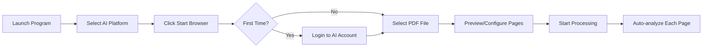

# PDF AI Analyzer

<p align="center">
  <strong>🤖 Multi-Platform AI Image Analysis Automation Tool</strong>
</p>

<p align="center">
  English | <a href="./README.md">简体中文</a>
</p>

<p align="center">
  
  
  
  
  
</p>

---

## ✨ Features

PDF AI Analyzer is an automation tool that converts PDF files page by page into images and automatically sends them to multiple mainstream AI platforms for analysis and explanation.

### 🎯 Core Features

| Feature | Description |
|---------|-------------|
| 📄 **PDF to Image** | High-quality PDF page conversion using PyMuPDF (no Poppler required) |
| 🤖 **Multi-Platform Support** | Supports ChatGPT, Claude, Google Gemini, and DeepSeek |
| 🔄 **Fully Automated** | Automatic image upload, prompt sending, response waiting, and next page processing |
| 💾 **Session Persistence** | Browser login state automatically saved, no re-login required |
| 🎨 **Modern UI** | Beautiful Glassmorphism deep-space glass design |
| 🌐 **Bilingual Interface** | Switch between Chinese and English with one click |
| 📑 **Page Grouping** | Customize groups to send multiple pages to AI at once |
| 🔢 **Custom Order** | Support custom batch processing order |
| 🔁 **Smart Retry** | Automatic retry mechanism for empty responses (configurable) |
| ⏸️ **Pause & Resume** | Pause processing and continue from where you left off |

### 🌐 Supported AI Platforms

| Platform | URL | Status |
|----------|-----|--------|
| ChatGPT | chatgpt.com | ✅ Fully Supported |
| Google Gemini | gemini.google.com | ✅ Fully Supported |
| DeepSeek | chat.deepseek.com | ✅ Fully Supported |
| Claude | claude.ai | ✅ Fully Supported |

---

## 📦 Installation

### System Requirements

- **Operating System**: Windows 10/11, macOS, Linux
- **Python**: 3.11 or higher
- **Browser**: Chrome or Edge (Playwright handles this automatically)

### Option 1: Pre-built Releases (Recommended)

Download the archive for your platform from [Releases](https://github.com/NeoNumber01/PDF_AI_Analyzer/releases):

- **Windows**: `PDF_AI_Analyzer-Windows.zip`
- **macOS**: `PDF_AI_Analyzer-macOS.zip`
- **Linux**: `PDF_AI_Analyzer-Linux.tar.gz`

Extract and run the `PDF_AI_Analyzer` executable.

### Option 2: Install from Source

```bash
# 1. Clone the repository
git clone https://github.com/NeoNumber01/PDF_AI_Analyzer.git
cd PDF_AI_Analyzer

# 2. Create virtual environment
python -m venv venv

# 3. Activate virtual environment
# Windows PowerShell:
.\venv\Scripts\Activate.ps1
# Windows CMD:
.\venv\Scripts\activate.bat
# macOS/Linux:
source venv/bin/activate

# 4. Install dependencies
pip install -r requirements.txt

# 5. Install Playwright browser
playwright install chromium
```

> 💡 **Note**: This project uses PyMuPDF for PDF to image conversion, no external dependencies like Poppler required.

---

## 🚀 Usage

### Option 1: GUI (Recommended)

**Windows users**: Double-click `启动.bat` or run in PowerShell:

```powershell
.\启动.ps1
```

**Or run manually**:

```bash
python src/gui_pyside.py
```

### Option 2: Command Line

```bash
# Interactive mode
python src/main.py

# Specify PDF file
python src/main.py "path/to/your/file.pdf"
```

### Workflow



1. **Launch the program** - Run the startup script or GUI
2. **Select AI platform** - Choose the AI platform from the dropdown
3. **Start browser** - Click "Start Browser" button
4. **Login** - Log in to your AI platform account (first time only)
5. **Select PDF** - Add PDF files to analyze (batch add supported)
6. **Preview pages** - Enable/disable specific pages, create groups
7. **Start processing** - Click "Start", the program will automatically send each page and wait for responses

> ⚠️ **First Run**: You need to manually log in to your AI platform account. The login state will be saved to the `browser_data/` directory for future sessions.

---

## 📖 User Guide

### Interface Overview

The program interface is divided into the following areas:

| Area | Function |
|------|----------|
| **Platform Selection** | Dropdown to select AI platform (ChatGPT/Claude/Gemini/DeepSeek) |
| **Browser Control** | Start/Close browser buttons |
| **Prompt Input** | Edit prompt text to send to AI |
| **PDF List** | Display added PDF files |
| **Control Buttons** | Add PDF, Preview, Start/Pause/Stop |
| **Status Bar** | Display current processing status and progress |
| **Language Switch** | Toggle between Chinese/English interface |

### Step-by-Step Instructions

#### Step 1: Start Browser and Login

1. Select the AI platform you want to use at the top
2. Click the **"Start Browser"** button
3. Browser window will open and navigate to the selected platform
4. **First time**: Please manually log in to your account in the browser
5. After successful login, status bar will show "Browser ready"

> 💡 **Tip**: Login state is automatically saved, no need to re-login next time.

#### Step 2: Add PDF Files

1. Click the **"Add PDF"** button
2. Select one or more PDF files in the file dialog
3. Selected files will appear in the PDF list
4. You can continue adding more files

**Batch Adding**:
- Hold `Ctrl` and click to select multiple files
- Hold `Shift` and click to select a continuous range

#### Step 3: Preview and Configure Pages (Optional)

1. Select a file in the PDF list
2. Click **"Preview"** button to open the preview window
3. In the preview window you can:

| Action | Description |
|--------|-------------|
| **Check/Uncheck** | Enable or disable a page |
| **Ctrl+Click** | Multi-select pages |
| **Create Group** | Select multiple pages and click "Create Group" to send them together |
| **Adjust Order** | Drag or use up/down buttons |
| **Input Order** | Customize processing order (e.g., 3,1,2,5) |
| **Double-click** | View high-resolution image |

#### Step 4: Edit Prompt

1. Edit the prompt text in the input box
2. Default prompt: "Please explain this image in detail."
3. Modify as needed for your use case

**Prompt Examples**:
```
Please analyze all formulas in this image and explain the derivation step by step.
```

#### Step 5: Start Processing

1. Make sure browser is started and logged in
2. Make sure at least one PDF file is added
3. Click the **"Start"** button
4. The program will automatically:
   - Convert PDF pages to images
   - Upload each page (or group) to the AI platform
   - Send prompt and wait for response
   - Process next page/group

#### Step 6: Pause and Resume

- **Pause**: Click **"Pause"** button, processing will pause after current page completes
- **Resume**: Click **"Resume"** button to continue from where you left off
- **Stop**: Click **"Stop"** button to completely terminate processing

### Keyboard Shortcuts

| Shortcut | Function |
|----------|----------|
| `Ctrl+Click` | Multi-select pages |
| `Shift+Click` | Select continuous range |
| `Double-click` | View full image |
| `Ctrl+Scroll` | Zoom in image viewer |

### Important Notes

1. **Don't manually operate the browser**: Avoid interacting with the browser during processing
2. **Don't modify settings during processing**: Once processing starts, avoid changing the document queue, groups, or sorting settings
3. **Keep network stable**: AI responses require a stable internet connection
4. **Be patient**: Complex image analysis may take some time
5. **Check output**: After completion, review all responses in the AI platform chat

## 📑 Advanced Features

### Page Grouping Modes

Three grouping modes are supported:

| Mode | Description |
|------|-------------|
| **Single Page** | Send each page to AI individually |
| **Fixed N Pages** | Send N pages as a group |
| **Custom Groups** | Manually select pages to create groups |

### Custom Batch Order

In the page preview window, you can:
- Drag and drop to reorder groups
- Use "Input Order" button to specify processing order
- Move groups up/down with buttons

### Empty Response Retry

When AI returns empty content, the program automatically:
1. Detects empty output
2. Waits for specified time (default 3 seconds)
3. Resends the request
4. Retries up to 3 times (configurable in config.py)

---

## ⚙️ Configuration

Edit `config.py` to customize the following settings:

| Setting | Default | Description |
|---------|---------|-------------|
| `PROMPT_TEXT` | "Please explain..." | Prompt sent to AI |
| `PDF_DPI` | 200 | PDF to image resolution |
| `WAIT_TIMEOUT` | 120000 | Response timeout (ms) |
| `DELAY_BETWEEN_PAGES` | 3 | Delay between pages (seconds) |
| `EMPTY_RESPONSE_MAX_RETRIES` | 3 | Max retries for empty response |
| `EMPTY_RESPONSE_RETRY_DELAY` | 3 | Wait time before retry (seconds) |

---

## 📁 Project Structure

```
PDF_AI_Analyzer/
├── src/
│   ├── gui_pyside.py          # PySide6 GUI (main entry)
│   ├── page_preview.py        # Page preview and grouping
│   ├── base_automation.py     # AI platform base class
│   ├── chatgpt_automation.py  # ChatGPT automation
│   ├── claude_automation.py   # Claude automation
│   ├── gemini_automation.py   # Gemini automation
│   ├── deepseek_automation.py # DeepSeek automation
│   ├── platform_factory.py    # Platform factory pattern
│   ├── pdf_converter.py       # PDF to image module
│   ├── i18n.py                # Internationalization (Chinese/English)
│   └── main.py                # CLI entry
├── browser_data/              # Browser data (login state)
├── output/                    # Converted images
├── config.py                  # Configuration file
├── requirements.txt           # Python dependencies
├── 启动.bat                   # Windows startup script
├── 启动.ps1                   # PowerShell startup script
└── 打包.bat                   # PyInstaller packaging script
```

---

## 🔧 Troubleshooting

### PDF Conversion Failed
- Ensure PyMuPDF is correctly installed: `pip install PyMuPDF`
- Check if the PDF file is corrupted or encrypted

### Browser Startup Failed
- Run `playwright install chromium` to install the browser
- Check `browser_data/` directory permissions

### Login State Lost
- Delete the `browser_data/` directory and log in again
- Ensure the browser is closed properly

### AI Response Timeout
- Increase the `WAIT_TIMEOUT` value in `config.py`
- Check network connection stability

### Grouping Not Working
- Make sure to select pages in the preview window first
- Use Ctrl+Click to multi-select, then create group

---

## 📝 Dependencies

```
PyMuPDF>=1.23.0      # PDF processing
Pillow>=10.0.0       # Image processing
playwright>=1.40.0   # Browser automation
python-dotenv>=1.0.0 # Environment variables
PySide6>=6.6.0       # GUI framework
```

---

## 🤝 Contributing

Issues and Pull Requests are welcome!

---

## 📄 License

This project is licensed under the MIT License - see the [LICENSE](LICENSE) file for details.
